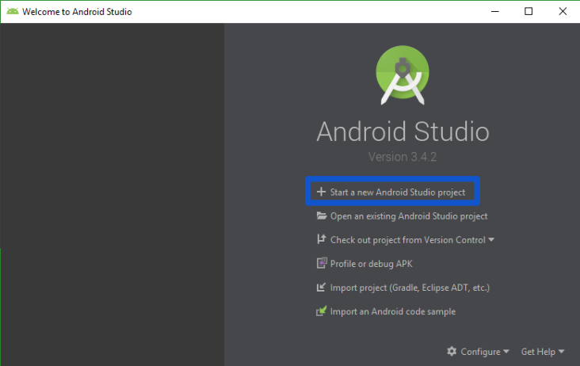

## Sesion 01 - Ejemplo 01

### OBJETIVO 
 - El alumno creará su primer su primera apliación con Android Studio. 

#### REQUISITOS 
1. Android Studio instalado

#### DESARROLLO
1. La primera vez que iniciamos Android Studios nos saludará con una pantalla parecida a la que tenemos aquí abajo.

Para empezar a crear un proyecto nuevo, seleccionamos la opcion **Start a new Android Studio Project**
 
