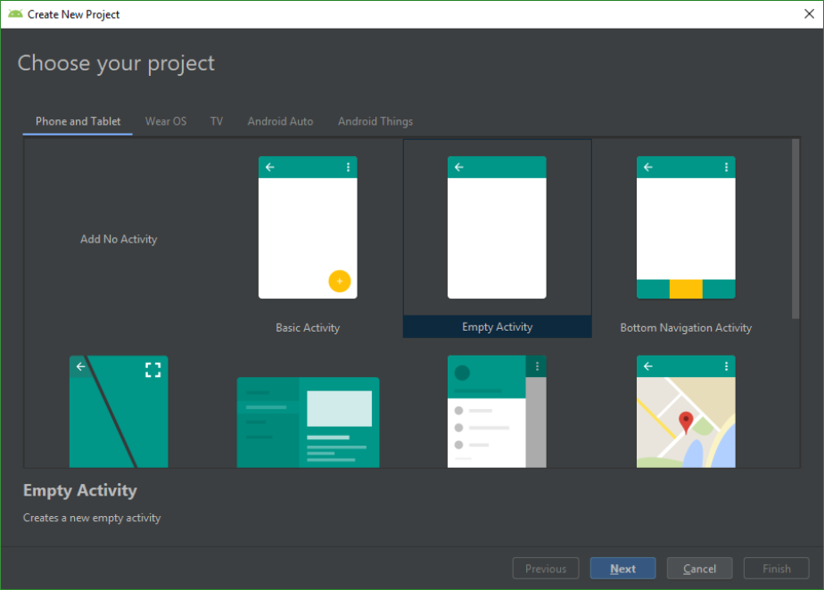
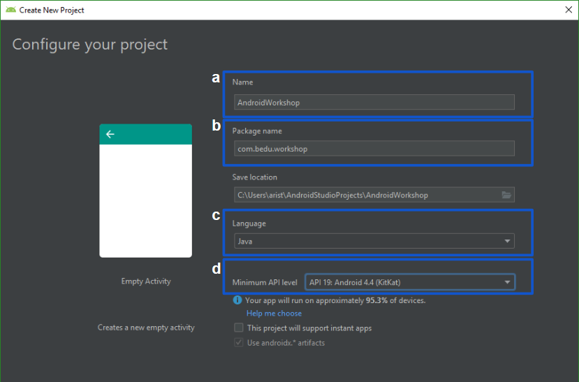

## Sesion 01 - Ejemplo 01

### OBJETIVO 
 - El alumno creará su primera apliación en Android Studio. 

#### REQUISITOS 
* Android Studio instalado

#### DESARROLLO
La primera vez que iniciamos Android Studio nos monstrará una pantalla de bienvenida parecida a la que tenemos aquí abajo.

1. Para empezar a crear un proyecto nuevo, seleccionamos la opcion **Start a new Android Studio Project** y se generará todo lo necesario para crear nuestra aplicación.
 

 2. A continuación elegimos el templete para nuestra apliación, en nuestro caso vamos a elegir **“Empty Activity”**.
 
 **Nota:**

 Primero dominaremos los templetes básicos,posteriormente podrás intentar con otros estilos de templetes.

 3. Vamos a crear nuestro proyecto.

    a. Nombre de la apliación.

    b. Nombre de tu equipo **(Todo tu equipo debe usar el mismo nombre).**

    c. Selecionar java como lenguaje.

    d. En la opción Minimum API level, seleccionar el SDK: **KitKat**

 
